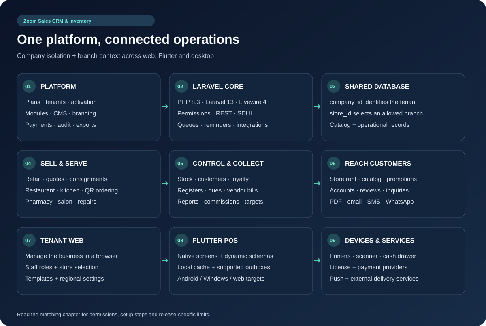

# Zoom Sales CRM & Inventory — Complete Feature Guide and Architecture

This manual covers the Laravel platform and the Flutter app found in this workspace. Source review date: 23 September 2026.

Use the feature instructions below for day-to-day work, chapter 05 for industry workflows, chapter 06 for app screens and builds, and chapter 09 for the complete registered-route and source-action inventory. A source entry records implementation presence; it does not mean every provider, device or deployment was tested.

## Architecture and access

The backend uses Laravel `^13.17`, PHP `^8.3` and Livewire `^4.4`. Tenants share a database: `company_id` is the tenant boundary and `store_id` is the branch context. Product/customer identity can be company-wide while stock and operational records use branch scope. Company scoping depends on middleware binding the context; background and platform operations must establish the intended scope explicitly.

The web uses session authentication; tenant API endpoints use the custom `AuthenticateTenantApi` middleware and user permissions. Store access also checks company membership, assignment and active state. SDUI bootstrap supplies menus, themes, translations, features and schemas to clients. The Flutter app lives in the ignored, separate `mobile/` tree, which must be included separately when distributing source. NativePHP desktop support is also present in Composer and the Laravel desktop services; it is a separate client path from Flutter Windows.

### First operational setup

1. Complete installation and core activation; configure a plan and the required modules.
2. Create a tenant, verify the owner account and select the business mode.
3. Configure branch details, staff permissions, tax/payment rules and receipt templates.
4. Add catalog products and opening stock; set up supported printers and notifications.
5. Open a register, create a test sale, preview its document and confirm stock/payment results.
6. Verify the online storefront, reminders and client synchronization for the enabled features.

Every workflow below requires its corresponding permission, active subscription where enforced, and module entitlement where applicable. A hidden menu alone is not an authorization rule.

## Platform administration

### F001. Platform dashboard and core activation

**Features:** Tenant overview and core license activation.

**Instructions:** Open /superadmin; review the platform overview; enter the purchased core license through the activation control.

**Benefit:** Centralizes platform health and activation.

Source: `app/Livewire/SuperAdmin/Dashboard.php`.

### F002. Tenant lifecycle

**Features:** Tenant search, creation, profile changes, plan assignment, module selection, suspension, activation and expiry extension.

**Instructions:** Open /superadmin/tenants; create or select a tenant; set its plan and modules; save. Use Suspend, Activate or Extend expiry for the corresponding lifecycle change.

**Benefit:** Keeps customer accounts and access under platform control.

Source: `app/Livewire/SuperAdmin/Tenants`.

### F003. Subscription plans and quotas

**Features:** Billing cycle, duration, price, currency, active state, users, devices, storage, branches, invoice/product/staff limits, custom extensions and feature switches.

**Instructions:** Open /superadmin/plans; create or edit a plan; set limits and included features; save; assign it to a test tenant and verify each intended restriction.

**Benefit:** Packages the service for different business sizes. Configured limits require enforcement by the relevant operation.

Source: `app/Livewire/SuperAdmin/Plans/Index.php`.

### F004. Activation codes

**Features:** Generate and revoke subscription activation codes.

**Instructions:** Open /superadmin/activation-codes; generate a code for the intended plan; deliver it to the customer; revoke unused access when appropriate.

**Benefit:** Supports provisioned or manually sold subscriptions.

Source: `app/Livewire/SuperAdmin/ActivationCodes/Index.php`.

### F005. Module lifecycle and governance

**Features:** Browse the vendor catalog, obtain licensed packages, install, activate, revalidate, deactivate, uninstall, prune orphan records and govern registration availability.

**Instructions:** Open /superadmin/modules; select the package and verify its license; activate; enable it for the tenant and its plan. Review data removal options before uninstalling.

**Benefit:** Adds vertical workflows while controlling which tenants can use them.

Source: `app/Livewire/SuperAdmin/Modules/Index.php`.

### F006. Platform payment gateways

**Features:** Gateway configuration and stored credential handling, including webhook secrets.

**Instructions:** Open /superadmin/payment-gateways; configure the provider offered by this release; save; validate its checkout and callback in the provider test environment.

**Benefit:** Connects subscription purchases to activation.

Source: `app/Livewire/SuperAdmin/PaymentGateways/Index.php`.

### F007. General, regional and registration settings

**Features:** Application name/version, minimum client build, currency, language, timezone, country/dial code, registration modes/modules, demo seeding and maintenance mode/message.

**Instructions:** Open /superadmin/settings; edit General and Regional fields; save; check registration and app bootstrap with a new session.

**Benefit:** Sets consistent defaults for new customers and clients.

Source: `app/Livewire/SuperAdmin/Settings/Index.php`.

### F008. Branding, appearance and theme customization

**Features:** Platform name, logo, favicon, authentication banner, primary/sidebar/landing colors, matching palettes and section themes.

**Instructions:** Open Settings → white-label/appearance controls; upload branding, choose colors and save; inspect sign-in, landing and administrative screens.

**Benefit:** Presents a consistent brand across surfaces.

Source: `app/Http/Controllers/SuperAdmin/ThemeCustomizerController.php`.

### F009. Landing CMS and Section Studio

**Features:** Hero text/buttons/banner/highlights/products; trust bar; features; hardware; industry solutions; statistics; about; testimonials; pricing; contact; CTA; downloads; FAQ; section order, visibility and custom content.

**Instructions:** Open Settings → landing/Section Studio; choose a section; edit its content and visibility; reorder; save; inspect the public landing page.

**Benefit:** Lets operators maintain marketing content without changing templates.

Source: `app/Livewire/SuperAdmin/Settings/Index.php`.

### F010. Public pages and menu builder

**Features:** Create/edit/delete public pages, home-page selection, anchor/page/custom URL links, ordering, nesting, target and active state.

**Instructions:** Open /superadmin/pages to maintain content; open /superadmin/menus to add and arrange links; save and follow each link publicly.

**Benefit:** Keeps help, company and campaign information discoverable.

Source: `app/Livewire/Superadmin/MenuBuilderComponent.php`.

### F011. Contact inquiries and custom fields

**Features:** Inquiry detail/status, search, bulk read/replied/delete actions, field creation/edit/deletion/order, default fields and form settings.

**Instructions:** Open /superadmin/inquiries; configure the intake fields; submit the public form; inspect the resulting inquiry and update its status.

**Benefit:** Captures structured sales inquiries and tracks responses.

Source: `app/Livewire/SuperAdmin/Inquiries/Index.php`.

### F012. Platform SMTP, social login and push

**Features:** SMTP settings/test email; social provider configuration; Firebase push credentials, Android configuration, order/invoice channels, sounds, repeats and test delivery.

**Instructions:** Use the matching Settings tabs or /superadmin/smtp; save provider details; use the test control and verify delivery/sign-in on the target device.

**Benefit:** Provides reusable communication and authentication services.

Source: `app/Livewire/SuperAdmin/Settings/Index.php`.

### F013. Language administration

**Features:** Locales, activation, translation editing, new/deleted keys, missing-English-key synchronization and language creation.

**Instructions:** Open /superadmin/languages; choose or create a locale; edit strings; save; enable the locale and verify a translated screen.

**Benefit:** Supports localized deployments from a central translation catalog.

Source: `app/Livewire/SuperAdmin/Languages/Index.php`.

### F014. Backups, system policy and audit

**Features:** Snapshot creation/download/delete, backup policy fields, system settings and audit filters.

**Instructions:** Open /superadmin/backups for exports, /superadmin/system for policy and /superadmin/audit for activity. Download a snapshot and inspect its contents.

**Benefit:** Provides export and accountability tools. Snapshots are JSON-table ZIP exports, not a point-in-time restore service.

Source: `app/Services/Backup/BackupService.php`.

## Identity and workspace

### F015. Registration, OTP, login and recovery

**Features:** Store registration, subdomain checks, email OTP/resend, password login, password reset/change, social login and invitation acceptance.

**Instructions:** Register or accept an invite; complete required OTP verification; sign in; use Forgot password if needed. Set up the server address first in the app.

**Benefit:** Provides entry and recovery flows for owners and staff.

Source: `app/Livewire/Auth`.

### F016. Staff, roles, permissions and commissions

**Features:** Invite/resend, role changes, active status, deletion, staff commission rates, role CRUD, permission presets, row/column selection and user overrides.

**Instructions:** Open /tenant/users; invite staff and assign roles; open Permissions; select only required actions; configure commissions where applicable.

**Benefit:** Aligns access and sales attribution with staff responsibilities.

Source: `app/Livewire/Tenant/Users`.

### F017. Impersonation and session/device revocation

**Features:** Authorized switch-to-user workflow, exit impersonation, device listing and revocation.

**Instructions:** Use the staff switch action where allowed; leave the impersonated session after review. Open /tenant/devices and revoke a retired device.

**Benefit:** Helps administrators reproduce staff issues and retire sessions.

Source: `app/Http/Controllers/Tenant/ImpersonationController.php`.

### F018. Multi-store management

**Features:** Branch creation, codes, addresses, tax IDs, receipt/invoice prefixes, active state, primary branch safeguards, staff assignment and store switching.

**Instructions:** Open /tenant/settings/stores; add a branch within the plan limit; save details; assign staff; switch before recording stock or sales.

**Benefit:** Shares a company catalog while tracking branch activity separately.

Source: `app/Http/Controllers/Api/Tenant/StoreController.php`.

### F019. Dashboard and POS layout selection

**Features:** Sales/order/customer/low-stock metrics, charts, receivables shortcuts, date ranges and selectable POS/dashboard layouts.

**Instructions:** Open the dashboard; select a range; tap a metric or due shortcut; choose the POS layout when launching the register.

**Benefit:** Moves from a summary to the records needing attention.

Source: `app/Livewire/Tenant/Dashboard.php`.

## Catalog and inventory

### F020. Products and identifiers

**Features:** Product creation/edit/deletion, SKU/item-code/barcode generation and scanning, pricing, images, category/brand/unit association and inventory fields.

**Instructions:** Open Products or app Inventory; create a product; enter its identifiers and prices; assign classification; save; find it from POS.

**Benefit:** Maintains one reusable catalog for checkout and ordering.

Source: `app/Livewire/Tenant/Products/Index.php`.

### F021. Variants, modifiers and spice levels

**Features:** Variant rows, modifier selections, spice options and their price adjustments.

**Instructions:** Edit a product; add the available option rows; save; select the product in the appropriate POS and verify the resulting line price.

**Benefit:** Handles product and food customization consistently.

Source: `app/Livewire/Tenant/Products/Index.php`.

### F022. Bulk product import

**Features:** Template/demo-data download, file selection, import processing and imported-product refresh.

**Instructions:** Open bulk import; download the release template; populate its columns; import a small sample, review errors, then import the remaining rows.

**Benefit:** Reduces repetitive catalog entry.

Source: `app/Livewire/Tenant/Products/ProductBulkImportComponent.php`.

### F023. Stock adjustment and branch quantities

**Features:** Stock adjustments and per-store quantity tracking.

**Instructions:** Select the active branch; open a product stock adjustment; enter the adjustment and required details; save and verify the branch balance.

**Benefit:** Keeps physical stock counts aligned with sales records.

Source: `app/Http/Controllers/Api/V1/PosSyncApiController.php`.

### F024. AI product imagery

**Features:** Image-generation availability, provider configuration and queued product image generation.

**Instructions:** Configure an available AI provider in platform/tenant settings; open the product image generation control; request an image and review it before use.

**Benefit:** Assists catalog image preparation; provider configuration and service availability are required.

Source: `app/Services/AiImageGeneratorService.php`.

### F025. Categories, brands, units and suppliers

**Features:** Independent create/edit/delete catalogs for product classification, measurement and suppliers.

**Instructions:** Maintain /tenant/categories, /tenant/brands, /tenant/units and /tenant/suppliers; reference those records from products and bills.

**Benefit:** Reuses consistent names and relationships across inventory and purchasing.

Source: `app/Http/Controllers/Api/V1/CatalogAdminApiController.php`.

## Selling and documents

### F026. Retail checkout and cart

**Features:** Grid/category lookup, scanning, item quantities/removal, quick discounts, keypad/custom items, authorized price overrides, customer selection and quick creation.

**Instructions:** Open POS; confirm the active branch/register; scan or select items; adjust the cart; select the customer; review totals and checkout.

**Benefit:** Combines catalog lookup and payment into one cashier workflow.

Source: `app/Livewire/Tenant/Sales/Create.php`.

### F027. Weighing-scale barcodes

**Features:** Configurable scale prefix and weight/price interpretation, barcode parsing and applying measured quantities.

**Instructions:** Configure the scale barcode format in settings; scan a sample encoded label; verify product matching, quantity and price before routine use.

**Benefit:** Avoids retyping quantities for weighed products.

Source: `app/Livewire/Tenant/Sales/Create.php`.

### F028. Held orders, split payments and register gate

**Features:** Hold a cart, payment rows, register opening and stale-session settlement before checkout.

**Instructions:** Hold an unfinished order when needed; at checkout select split payment and allocate amounts; complete any required register-opening step.

**Benefit:** Supports interrupted sales and mixed payment tenders.

Source: `app/Http/Controllers/Api/V1/SaleApiController.php`.

### F029. Sales and invoices

**Features:** Sales list/search, detail, completion/cancellation, PDF, due filters, custom creation-date ranges and customer delivery.

**Instructions:** Open Sales; select the filter; open a record; review payment and items; use the permitted complete/cancel or document actions.

**Benefit:** Provides an auditable view of completed and outstanding business.

Source: `app/Livewire/Tenant/Sales`.

### F030. Quotations

**Features:** Create/edit/delete/bulk-delete, quick customer, status changes, terms/defaults, PDF, messaging, conversion to sale and opening in POS.

**Instructions:** Create a quote with customer/items; preview and send; update its status; convert or open it in POS when the customer accepts.

**Benefit:** Reuses quoted information during checkout.

Source: `app/Livewire/Tenant/Quotes`.

### F031. Invoice and quotation template studio

**Features:** Document colors, logos, alignment, prefixes, terms, bank/payment details, receipt format and available delivery settings.

**Instructions:** Open Store Settings → Invoice/Quotation Templates; customize; preview a document with real line items; save.

**Benefit:** Produces consistent customer documents.

Source: `app/Http/Controllers/Tenant/DocumentTemplateController.php`.

### F032. Unified dispatch and public documents

**Features:** Preview/action/send sheets, thermal/A4 output, PDF or document link, email, SMS, WhatsApp, custom channels and batch dispatch.

**Instructions:** Open a document → Share/Send; preview; select recipient/channel and attachment or link; submit and check the returned delivery result.

**Benefit:** Groups document delivery choices in one workflow. Public links are customer-facing and should be shared deliberately.

Source: `app/Http/Controllers/Api/UnifiedDispatchController.php`.

### F033. Consignment dispatch and reconciliation

**Features:** Create stock allocations, dispatch goods, record sold and returned quantities, review revenue and finalize to an invoice/sale.

**Instructions:** Open Consignments; add customer/items; dispatch; reconcile sold/returned quantities; review and finalize.

**Benefit:** Tracks goods placed with customers before final settlement.

Source: `app/Livewire/Tenant/Consignments`.

## Customers and finance

### F034. Customer profiles and loyalty

**Features:** Customer creation/edit/deletion, search, contact information, loyalty points and manual points adjustment.

**Instructions:** Open Customers; maintain contact details; use points adjustment with the intended value; verify the updated balance.

**Benefit:** Keeps sales history and loyalty information attached to the customer.

Source: `app/Livewire/Tenant/Customers/Index.php`.

### F035. Customer credit ledger and settlement

**Features:** Credit sales, customer ledger, payment entry and settlement.

**Instructions:** Open a customer → Credit ledger; review outstanding sales; record the payment using the correct amount and method; confirm the remaining balance.

**Benefit:** Tracks account balances and collections together.

Source: `app/Services/Financial/CustomerLedgerService.php`.

### F036. Cash register and movement slips

**Features:** Opening balance/denominations, register history, cash movements, closing reconciliation, Z report and movement view/PDF.

**Instructions:** Open Cash Register; enter opening cash; record movements during the shift; count closing cash; close and review the Z report.

**Benefit:** Explains differences between expected and counted cash.

Source: `app/Livewire/Tenant/Financials/CashRegister.php`.

### F037. Receivables and reminders

**Features:** Due lists, payment recording, immediate reminders, scheduled reminders and customer shortcuts.

**Instructions:** Open Finance → Receivables; choose the due tab/range; record a collection or schedule/send a reminder.

**Benefit:** Prioritizes collections and keeps follow-up linked to the balance.

Source: `app/Livewire/Tenant/Financials/Receivables.php`.

### F038. Vendor bills and payables

**Features:** Create/edit/delete bills and record full or partial settlements.

**Instructions:** Open Finance → Payables; select the vendor and bill details; save; record payments as they occur.

**Benefit:** Shows obligations and their remaining balances.

Source: `app/Livewire/Tenant/Financials/Payables.php`.

### F039. Payment methods, bank/UPI/Pix and card fees

**Features:** Method creation/order/activation, bank account details, UPI information, Pix key/merchant settings and debit/credit/installment fee settings.

**Instructions:** Open Settings → Payments/Financial; configure the desired method; save; preview checkout and validate fee calculations.

**Benefit:** Standardizes cashier tenders and payment instructions.

Source: `app/Livewire/Tenant/Settings/Index.php`.

### F040. Payment-method ledger

**Features:** Method-specific transaction history and CSV export.

**Instructions:** Open the payment method ledger; review the period and entries; export CSV for reconciliation.

**Benefit:** Reconciles transactions by payment channel.

Source: `app/Livewire/Tenant/Financials/PaymentMethodLedger.php`.

### F041. Tax rules and fiscal payloads

**Features:** Country rules, default/active rules, rates, subcomponents, tax calculations, invoice payload/QR generation and India GST, ZATCA and Peppol driver classes.

**Instructions:** Configure tax identity and rules; preview a representative invoice; review payload output with the fiscal integration implementer.

**Benefit:** Centralizes calculation and payload preparation. Driver output is not proof of government acceptance or live filing.

Source: `app/Services/FiscalEInvoicing`.

### F042. Reports, commissions and targets

**Features:** Summary, sales, profit/loss, payment methods, till closings, commissions, aging, date presets, CSV/export and target allocation.

**Instructions:** Open Reports; select report and dates; inspect/export. Open Sales Targets; allocate or split the target evenly; save.

**Benefit:** Supports performance review and staff goals.

Source: `app/Http/Controllers/Api/V1/ReportsApiController.php`.

## Online storefront

### F043. Published catalogs

**Features:** Product selection, select-all/clear, quick product creation, publish/revoke and public catalog ordering.

**Instructions:** Open Catalog; choose products; publish and share the generated /c/... link; revoke it when no longer needed.

**Benefit:** Creates a focused shareable sales catalog.

Source: `app/Livewire/Tenant/Catalog/Index.php`.

### F044. Storefront branding, domains and pages

**Features:** Banner/auth appearance, tenant domain configuration, categories, menu builder, anchor/custom links, custom pages, order and active state.

**Instructions:** Open Store Settings → Storefront; configure appearance/domain; create pages and arrange navigation; verify the public storefront URL.

**Benefit:** Connects the tenant brand and online catalog. DNS and TLS must also be configured for a custom domain.

Source: `app/Http/Controllers/Api/Tenant/StorefrontSettingsController.php`.

### F045. Customer account, addresses and wishlist

**Features:** Registration/login/logout, profile editing, address create/edit/delete, wishlist toggle/remove, cart calculation and order history.

**Instructions:** Open the storefront account; sign in; save delivery addresses; add wishlist products; review cart totals and order history.

**Benefit:** Lets returning customers reuse their profile and selections.

Source: `app/Http/Controllers/Api/V1/StorefrontCustomerApiController.php`.

### F046. Ordering, checkout, verification and tracking

**Features:** Catalog, order placement, verification-code send/check, coupon validation, payment methods, gateway initiation/verification and tracking code page.

**Instructions:** Build a storefront cart; select customer/delivery/payment details; complete verification if required; place/pay for the order; retain the tracking link.

**Benefit:** Connects online customer orders with tenant operations.

Source: `app/Http/Controllers/Tenant/StorefrontController.php`.

### F047. Coupons and promotion management

**Features:** Create/edit coupons, active status and deletion; validation and usage records.

**Instructions:** Open Coupons; enter the offer and limits presented by the form; save; test an eligible and an ineligible cart.

**Benefit:** Applies controlled promotional offers.

Source: `app/Livewire/Tenant/Coupons/Index.php`.

### F048. FAQs, reviews and inquiries

**Features:** FAQ defaults/create/edit/enable/delete; reviews enabled/approval settings and approve/reject/delete; store inquiry intake.

**Instructions:** Maintain FAQs; moderate reviews in Reviews; inspect Store Inquiries in the app or corresponding tenant screen.

**Benefit:** Answers common questions and manages customer feedback.

Source: `app/Livewire/Tenant/Reviews/Index.php`.

### F049. Ecommerce and outbound webhooks

**Features:** Incoming order normalization and configured outbound event delivery.

**Instructions:** Configure the integration channel and its authentication; submit a test order/event; verify the resulting tenant record and callback.

**Benefit:** Connects external commerce systems with the sales workflow.

Source: `app/Services/Integrations`.

## Automation and personalization

### F050. Notification feed and alarms

**Features:** Order/invoice alerts, dismiss/clear-all, sound settings, custom audio and push-device registration.

**Instructions:** Open notifications to inspect an alert; navigate to its record; dismiss it when handled. Configure sound/repeat behavior in notification preferences.

**Benefit:** Brings new operational events to staff attention.

Source: `app/Http/Controllers/Api/NotificationController.php`.

### F051. Scheduled, automated and vertical reminders

**Features:** Scheduled delivery, receivable/customer reminders, vertical reminders, tenant timezone/frequency settings and dispatch deduplication.

**Instructions:** Configure notification channels and reminder preferences; schedule the event; keep cron/queue workers running; inspect delivery status.

**Benefit:** Reduces manual follow-up on time-sensitive work.

Source: `app/Console/Commands/DispatchAutomatedReminders.php`.

### F052. Tenant communication channels

**Features:** Meta/Twilio/HTTP WhatsApp options, Twilio/MSG91/generic SMS, SMTP, webhook channels, custom authentication/headers/payloads/events and test controls.

**Instructions:** Open Settings → Integrations; configure and enable the channel; save; run its test; select it in document/reminder delivery.

**Benefit:** Lets tenants use their chosen communication services.

Source: `app/Livewire/Tenant/Settings/Index.php`.

### F053. Navigation, form labels and local appearance

**Features:** Menu visibility/order/hierarchy, icons/labels, form label customization, dock positioning, theme colors, surfaces and page transitions.

**Instructions:** Open Navigation or App Preferences; arrange items and choose appearance; save; verify permissions still control visibility.

**Benefit:** Adapts the workspace to the staff member and business.

Source: `mobile/lib/features/settings/screens/app_preferences_screen.dart`.

### F054. Tenant languages, currency and time

**Features:** Default store language, phrase overrides/custom phrases, currency symbol/decimals/position, additional currencies and tenant time handling.

**Instructions:** Open Languages and regional/financial settings; choose defaults and overrides; verify dates and totals on a receipt.

**Benefit:** Presents transactions in the intended local format.

Source: `app/Livewire/Tenant/Languages/Index.php`.

### F055. Subscriptions and billing documents

**Features:** Plan selection, activation-code redemption, free activation where offered, Razorpay/Mercado Pago purchase flows and subscription invoice PDF/email.

**Instructions:** Open Billing/Subscription; select the plan or redeem a code; complete provider verification; download the resulting invoice.

**Benefit:** Lets tenants maintain their subscription access.

Source: `app/Livewire/Tenant/Billing/Index.php`.

### F056. API keys and demo-data cleanup

**Features:** Create/toggle/revoke tenant keys, API integration settings and tenant sample-data removal endpoint.

**Instructions:** Open API settings to issue a scoped integration credential; retire unused keys. Use demo cleanup only after reviewing the sample records it targets.

**Benefit:** Supports integrations and transition from evaluation data.

Source: `app/Http/Controllers/Api/V1/TenantDemoDataController.php`.

## Industry and app coverage

Restaurant, pharmacy, salon, repair, service orders and lead CRM are documented individually in [chapter 05](05_SDUI_AND_MODULE_PACKAGES.md). Flutter screen families, shared controls and all Dart source surfaces are listed in [chapter 06](06_FLUTTER_APP_SETUP_AND_BUILD.md). The [complete technical inventory](09_TROUBLESHOOTING_AND_FAQ.md) records every registered route and public action found during this review, including compatibility aliases and packaged-module sources.
