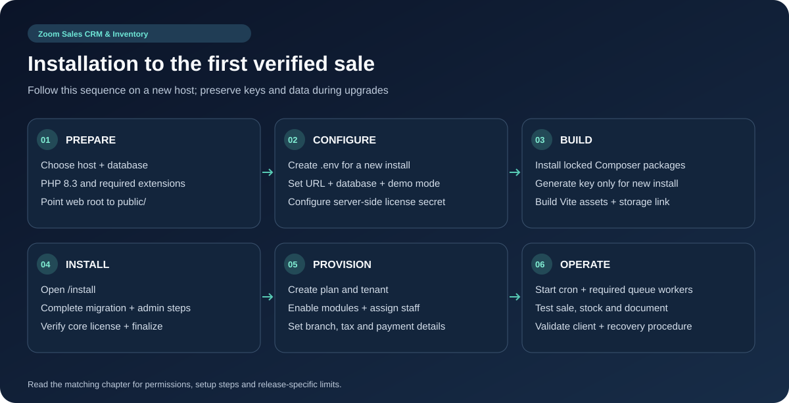

# Backend Installation and Commercial Rollout




### 3.1 Prepare a new installation

Extract the purchased release or clone the real private repository into the chosen application directory. The following examples assume `/var/www/saas`; replace it with your actual deployment path. Configure Nginx's document root as `/var/www/saas/public`, HTTPS, and the matching PHP-FPM socket. Laravel's [deployment documentation](https://laravel.com/framework/docs/deployment) provides the server configuration reference.

For a **new installation only**, prepare the environment before running Composer scripts:

```bash
cd /var/www/saas
cp .env.example .env
```

Edit `.env` using installation-specific values. These are placeholders, not usable credentials:

```dotenv
APP_NAME="Zoom Sales CRM & Inventory"
APP_ENV=production
APP_DEBUG=false
APP_URL=https://saas.example.com
DEMO_MODE=false

DB_CONNECTION=mysql
DB_HOST=127.0.0.1
DB_PORT=3306
DB_DATABASE=metroretail_core
DB_USERNAME=metroretail_app
DB_PASSWORD="REPLACE_WITH_A_GENERATED_PASSWORD"

LICENSE_SERVER_SECRET="REPLACE_WITH_THE_AUTHORITY_SHARED_SECRET"
LICENSE_SERVER_TIMEOUT=10
```

Provision the database and its application user separately. Keep `.env` outside the public document root. Use the same PHP release for CLI, PHP-FPM and Supervisor.

```bash
composer install --no-dev --optimize-autoloader
composer check-platform-reqs --no-dev
php artisan key:generate
npm ci
npm run build
php artisan storage:link
```

Give the service account write access to `storage`, `bootstrap/cache`, and any configured module-installation directories. Do not regenerate `APP_KEY` or overwrite `.env` when upgrading an existing installation.

### 3.2 Complete the installer

Open `/install` on the new host and complete requirements, environment, migrations, administrator account and finalization. The administrator step verifies the core purchase key with the license service. Finish the wizard so the application's installation state is recorded; migrations alone do not complete installation.

For an existing installation, back up the database, uploaded files and environment before applying release migrations. The database seeder creates platform defaults, landing content and permissions; it adds demo tenants when `DEMO_MODE=true`. Review seeders before running them against an established customer deployment.

```bash
php artisan migrate --force
php artisan optimize:clear
php artisan config:cache
php artisan route:cache
php artisan view:cache
php artisan queue:restart
```

The draft's `LICENSE_VERIFICATION_HOST` and `LICENSE_KEY` variables are not read by this backend's license configuration. The authority URL is fixed in `config/services.php`; the purchase key is entered through the activation/installation workflow.


## Commercial rollout instructions

1. Set actual plan prices, durations, branch allocations and included features in Superadmin Plans.
2. Configure license activation, gateway callbacks, SMTP, notifications and the selected module entitlements.
3. Create an evaluation tenant with an owner and a restricted staff account. Verify a branch switch and permission denial as well as successful sales.
4. Exercise products, checkout, stock, receipts, returns/reconciliation where offered, collections, exports and the chosen industry workflow.
5. Configure scheduler/queues as described in chapter 04, and test backup recovery using the infrastructure backup procedure.
6. Distribute the correct Android/Windows client, its dependencies and this manual; record the release and signing ownership.

### Proposed service packages

| Deliverable | Regular service proposal | Extended service proposal |
| --- | --- | --- |
| Deployment and custom backend connection | Customer installs/configures | Provider installation if contracted |
| Multi-store operations | Subject to plan and enabled features | Subject to plan and enabled features |
| Branding and package identifiers | Customer configures | Provider configures if contracted |
| APK, AAB and Windows release bundle | Customer builds | Provider delivers if contracted |
| Installation assistance | Documentation | Hands-on support if contracted |

These are service-delivery proposals from the brief, not enforced license rights or promises made by the source code. Confirm the purchased license and agreed delivery scope before offering them commercially.
