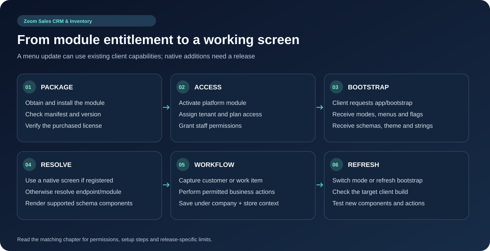

# Industry Modules, SDUI and Business Workflows

## How a module becomes available

The platform has a module registry/catalog, package installer and subscription entitlement service. Installed code, active platform license, tenant module selection, subscription feature entitlement and user permissions all affect availability. The plan can expose an extension without making it a registration operating mode: the lead-management manifest is an extension with `registration_allowed=false`.

1. Superadmin opens Modules and obtains/installs the purchased package.
2. Verify and activate the module, then enable the intended plan/tenant access.
3. Tenant selects its available operating mode and assigns staff permissions.
4. Refresh app bootstrap so its menus, screens and feature flags are current.
5. Complete the workflow below with a test record before live use.

## V01. Restaurant POS, floors and tables

**Open:** /tenant/restaurant/pos; /tenant/restaurant/tables.

**Features:** Floor and table creation/edit/deletion; table status; dine-in/takeaway service types; seat selection; variants, modifiers and spice levels; price override; customer picker/quick creation; split payments; transfer table; kitchen dispatch; bill settlement; document delivery.

**Instructions:** Create floors and tables; choose service type/table; add seats and customized items; send the order to the kitchen; review table changes; select customer and payment; settle the bill and share the receipt.

**Benefit:** Keeps seating, kitchen preparation and payment connected.

Source: `app/Livewire/Tenant/Restaurant/Pos.php`.

## V02. Kitchen tickets, KDS and QR table ordering

**Open:** /tenant/restaurant/kds; table QR action.

**Features:** KOT print views, preparation/ready/served transitions, cancellation, dismissible alarms, elapsed-time chips, QR stand/card and public token-based table ordering.

**Instructions:** Open KDS; select a ticket and mark its preparation stage; print the kitchen slip if needed; use the table QR card for customer ordering; mark served once delivered.

**Benefit:** Gives kitchen and floor staff a shared preparation queue.

Source: `app/Http/Controllers/Tenant/Restaurant/TableOrderController.php`.

## V03. Pharmacy batches, prescriptions and checkout

**Open:** /tenant/pharmacy; /tenant/pharmacy/batches; /tenant/pharmacy/prescriptions.

**Features:** Batch creation, batch barcode, expiry information, stock adjustment, returns, prescription intake/attachments, dispense/cancel actions, prescription checkout sheets and pharmacy product search.

**Instructions:** Activate the pharmacy module; create products and batches; record expiry/quantity; capture a prescription and its attachment; review the selected batch and dispense through the prescription/POS checkout; inspect stock and sale results.

**Benefit:** Links dispensing records to batches and prescription intake. These records do not establish clinical validation or regulatory certification.

Source: `app/Http/Controllers/Api/V1/PharmacyApiController.php`.

## V04. Salon calendar, specialists and services

**Open:** /tenant/salon; /tenant/salon/stylists; /tenant/salon/services.

**Features:** Day navigation, service categories, service cart, booking creation, appointment availability/status, specialist selection/activation, service creation/edit/delete and salon checkout.

**Instructions:** Activate the salon module; create services and active specialists; select date/services/customer; check available appointment slots; book; update status and checkout when the service is delivered.

**Benefit:** Connects appointment planning with the service catalog and billing.

Source: `app/Http/Controllers/Api/V1/SalonApiController.php`.

## V05. Repair intake, diagnosis and settlement

**Open:** /tenant/repair; /tenant/repair/tickets; /tenant/repair/categories.

**Features:** Dashboard statistics, device categories/defaults, ticket intake, status transitions, technician assignment, diagnostic checklist, parts add/remove, labor charges, share/dispatch, settlement and ticket deletion endpoint.

**Instructions:** Create a device category and its checklist; intake the customer/device; assign a technician; record diagnosis, parts and labor; update the ticket status; collect payment through checkout and share the ticket details.

**Benefit:** Traces a repair from intake through completion and payment.

Source: `app/Http/Controllers/Api/V1/RepairApiController.php`.

## V06. Repair customer portal and reminders

**Open:** /portal/repair/{ticket_number}.

**Features:** Customer-facing ticket progress page, ticket notifications and repair reminder command.

**Instructions:** Use the ticket share/dispatch action to send its tracking link; verify the customer can see the intended progress; configure reminder delivery channels and the relevant job schedule.

**Benefit:** Reduces repeated progress enquiries. The current portal is login-free; handle its link as customer information.

Source: `app/Http/Controllers/Tenant/RepairPortalController.php`.

## V07. General service orders and warranty workflow

**Open:** /tenant/service-orders.

**Features:** Create/edit/view/delete orders, customer selection, parts search/add/remove, total calculation and lifecycle status updates.

**Instructions:** Open Service Orders; select the customer and service details; add parts; review totals; save; update status as work progresses.

**Benefit:** Tracks general service work separately from ordinary retail cart entries.

Source: `app/Livewire/Tenant/ServiceOrders/Index.php`.

## V08. Lead management and follow-ups

**Open:** /tenant/leads and licensed lead-module navigation.

**Features:** Lead capture/list/detail/update/delete, pipeline/source attribution, activity creation/completion, follow-up listing, reminders, customer provisioning and quotation/invoice linking declared by the package.

**Instructions:** Enable the leadmanagement extension for the plan/tenant; capture a lead and source; record its next activity; complete follow-ups; link the corresponding quote/invoice or customer as the opportunity progresses.

**Benefit:** Connects pre-sale follow-up with customer and sales records.

Source: `module-packages/leadmanagement/module.json`.

## Server-driven UI contract

`GET /api/app/bootstrap` supplies the module list/active module, available modes, active features, menu structure, screen directory, schema contract, UI schema, translations, theme and configuration. `POST /api/app/mode` switches to an available mode and returns updated navigation. The Flutter component registry prefers registered native screens, then explicit endpoints, then module screens and dynamic-schema fallback.

Schemas can describe containers, headings/text, inputs, choices, lists/tables, catalog/cart controls, buttons, sheets, navigation and actions supported by the parser. A new layout composed of existing supported components can be delivered by the server. New native capabilities, unknown components or incompatible schema changes can require a client release; do not promise every future module works without an app update.

Use the package's manifest/navigation and schema validation when extending a module. Preserve existing endpoint aliases for installed clients. Unsupported UI must be tested on the minimum supported app build.

## Packaged module manifest inventory

The following flags/navigation labels are read directly from every package manifest in this workspace. Manifest presence does not prove that the package is currently installed or enabled for a customer.

### Lead Management System

Package `leadmanagement`; version `1.2.0`; layout `standard_grid`.

Feature declarations:

- `has_leads`: `true`.
- `has_activities`: `true`.
- `has_due_reminders`: `true`.
- `has_quotations_linking`: `true`.
- `has_invoices_linking`: `true`.
- `has_customer_autoprovision`: `true`.

Navigation:

- Lead Management: `lead_ops`.
- Lead Dashboard: `/api/tenant/lead-module/views/dashboard`.
- Capture Lead: `/api/tenant/lead-module/views/create-lead`.
- Leads Pipeline: `/api/tenant/lead-module/views/leads`.
- Follow-ups & Activities: `/api/tenant/lead-module/views/activities`.
- Lead Sources: `/api/tenant/lead-module/views/sources`.

### Pharmacy

Package `pharmacy`; version `1.0.0`; layout `standard_grid`.

Feature declarations:

- `has_barcode_scanner`: `true`.
- `has_expiry_tracking`: `true`.
- `has_due_reminders`: `true`.

Navigation:

- Pharmacy: `pharmacy_ops`.
- Pharmacy Dashboard: `/api/tenant/pharmacy-module/views/dashboard`.
- Drug Batches & Expiry: `/api/tenant/pharmacy-module/views/batches`.
- Prescriptions: `/api/tenant/pharmacy-module/views/prescriptions`.

### Repair Technician

Package `repairtechnician`; version `1.0.0`; layout `repair_kanban`.

Feature declarations:

- `has_barcode_scanner`: `true`.
- `has_due_reminders`: `true`.
- `has_checklist`: `true`.

Navigation:

- Repair: `repair_ops`.
- Repair Dashboard: `/api/tenant/repair-module/views/dashboard`.
- Repair Tickets: `/api/tenant/repair-module/views/tickets`.
- Device Categories: `/api/tenant/repair-module/views/categories`.

### Salon & Bookings

Package `salon`; version `1.0.0`; layout `service_booking_list`.

Feature declarations:

- `has_appointments`: `true`.
- `has_due_reminders`: `true`.
- `has_staff_selector`: `true`.

Navigation:

- Salon: `salon_ops`.
- Salon Dashboard: `/api/tenant/salon-module/views/dashboard`.
- Appointments: `/api/tenant/salon-module/views/appointments`.
- Service Catalogue: `/api/tenant/salon-module/views/services`.
- Stylists & Specialists: `/api/tenant/salon-module/views/stylists`.
