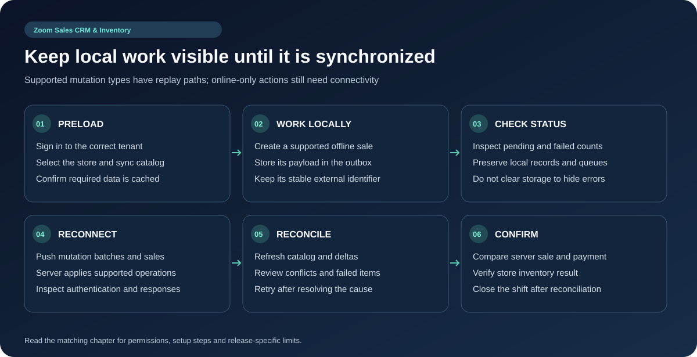
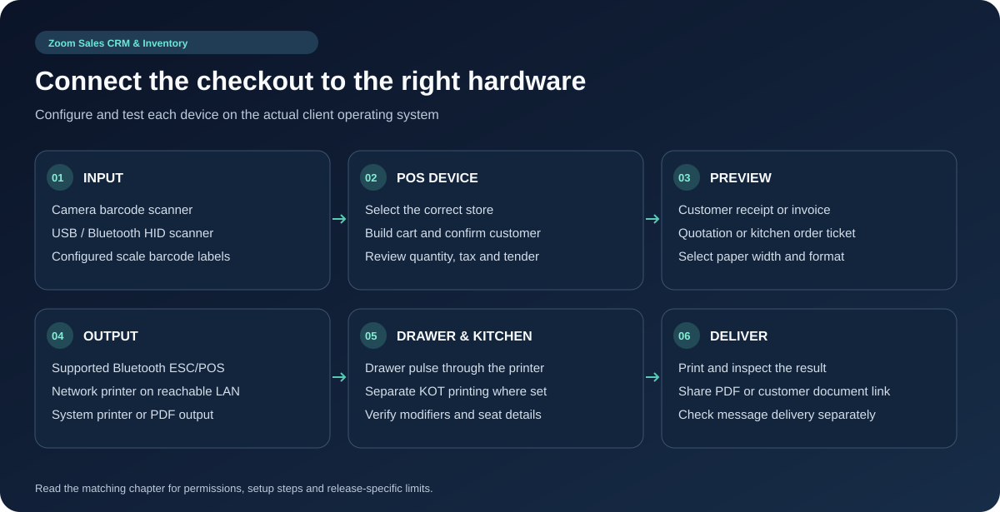

# Offline Sync, Printing and POS Hardware

## Local storage and synchronization

The Flutter app uses SQLite on supported mobile platforms, JSON-file storage on desktop and a preferences-backed JSON path for web. Cache buckets store lists/details; `outbox_sync` stores pending sales and `outbox_mutations` stores other queued writes. Scope-aware cache naming and active store context must be preserved when switching accounts or stores.

The sync engine pushes queued mutations through its batch endpoint and queued sales through its sales-push endpoint, then refreshes catalog/deltas. It exposes pending counts, online/offline/sync/error states, failed-item retry and conflict history. Mutation coalescing can replace repeated local edits and eliminate a create followed by delete before upload. The server's idempotency handling helps prevent reapplication of supported operations; do not describe this as an unconditional zero-duplicate guarantee.

### Supported mutation mapping found in the client

The batch builder maps products, customers, categories, brands, suppliers, units and quotations into typed arrays, with deletion mappings also including tax rules. It separately maps stock adjustments and customer payments. Unknown entity writes go into a generic `mutations` field; the code comments state that this generic replay path is not fully implemented server-side. Do not promise every screen or action is available offline.

### Instructions for an offline shift

1. Sign in and synchronize the intended tenant/store while online; confirm required products and payment settings are cached.
2. Create an offline sale using a workflow verified for this release. Keep the local transaction and outbox intact.
3. Check the pending count/status badge. Restore connectivity and request synchronization.
4. Inspect failed items and conflict history; retry only after resolving the reported problem.
5. Compare the server sale, stock and payment result with the local receipt before closing the shift.

Cached lists can be older than server data. Provider payments, OTP, license checks, server PDF generation and messaging can require connectivity even when catalog browsing works offline.

## NativePHP desktop synchronization

The Laravel desktop path has its own `DesktopSyncEngine`, client, bootstrap/session services, sync job and Livewire status/printer settings. Legacy `api/mysql.php`, `api/auth.php`, `api/subscription.php` and `api/platform_admin.php` routes support older clients. Treat these as a separate compatibility layer from Flutter's local database and outboxes.

## Hardware and printing instructions

| Device / output | Setup and use | Benefit / limit |
| --- | --- | --- |
| Camera scanner | Grant camera permission; open the scanner and scan a catalog barcode | Product lookup without a separate scanner |
| USB/Bluetooth HID scanner | Pair/connect to the device; focus the barcode field; scan a known product | Uses keyboard-style barcode input |
| Scale barcode | Configure prefix and weight/price format; scan a sample and inspect quantity/total | Supports encoded weighing labels; format must match settings |
| Bluetooth thermal printer | Pair the printer; choose it in app printer setup; set paper width and run a test | Depends on platform and compatible thermal plugin/device |
| Network thermal printer | Make printer reachable from the POS device; set its address/port and test | LAN printing depends on network access and supported printer protocol |
| A4/PDF/system printer | Open document preview; choose format and the available print/share target | Uses system/PDF printing where supported |
| Cash drawer | Connect to the printer's supported drawer port; configure/test the drawer pulse | A printer-controlled accessory, not an arbitrary network device |
| Kitchen printer | Select kitchen output and print a KOT sample with modifiers/seat details | Keeps kitchen preparation separate from customer receipts |

Preview invoice/quotation or KOT before printing. Check logo, paper width, tax/payment details, long item names, language characters, cut and drawer behavior on the actual hardware. Bluetooth permissions, code pages and device drivers differ by platform. Web printing does not automatically provide the same direct Bluetooth access as native mobile.

## Troubleshooting sync and hardware

For pending sync, check connectivity, authentication, store access, API response and conflict log. Preserve unsent transactions before reinstalling or clearing storage. For blank/garbled receipts, check paper width, character support and image rendering. For an unreachable printer, test the POS device's own network path. For duplicate KOTs, inspect whether the action was submitted more than once before retrying.
